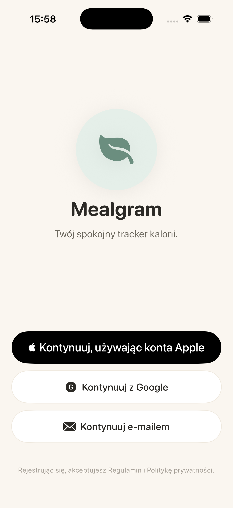
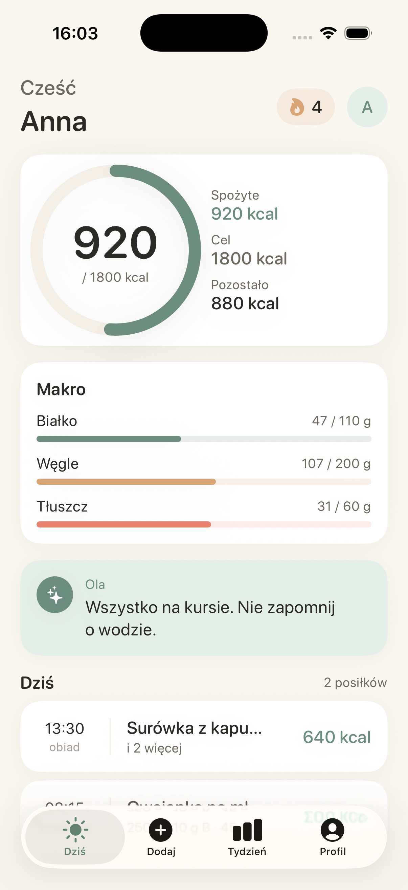
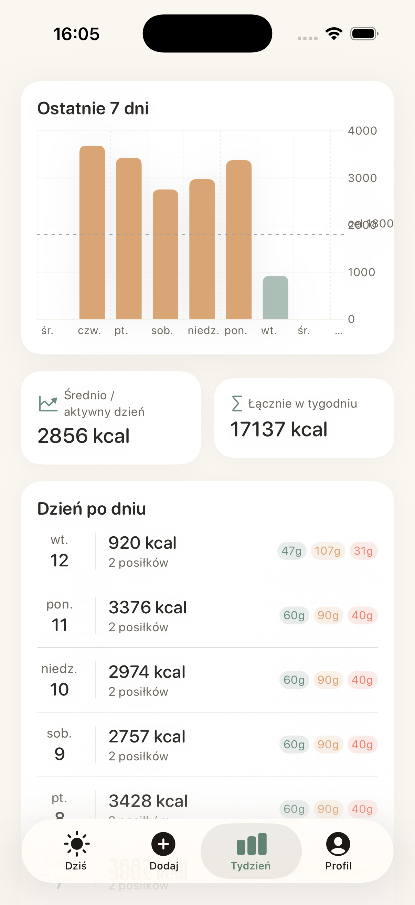
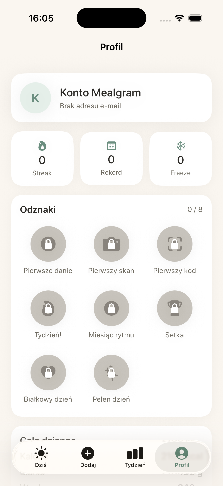

# Mealgram

iOS calorie tracker tailored for the Polish market. Three core ways to log a
meal — photo scan, barcode lookup, quick database — plus voice, recipe
library, and an AI coach ("Ola") in later milestones.

iOS 17+ • SwiftUI + SwiftData + TCA where it earns its keep • Cloudflare
Worker as the AI proxy • Supabase as the backend (lazy-wired). Strict
concurrency, swiftlint --strict, swift-format clean.

## Screenshots

| Auth | Today | Tydzień | Profil |
|------|-------|---------|--------|
|  |  |  |  |

## Features today

Five meal-entry paths reachable from the "+Dodaj" tab:

- 📸 **Photo scan** — AVFoundation camera → Cloudflare Worker → Gemini 2.5
  Flash. Mock detector available until the Worker is deployed; results
  screen lets you tap a row to edit name + macros, swipe-context to delete,
  or add a manual item.
- 📦 **Barcode** — AVCaptureMetadataOutput (EAN-8/13, UPC-E, QR, etc.) →
  public Open Food Facts API → portion picker.
- 🔎 **Quick Database** — bundled catalog of 43 handcrafted Polish dishes
  and fast-food items. Categorised, searchable.
- 🎙 **Voice** — SFSpeechRecognizer (`pl_PL`) with a live transcript bubble
  and edit-before-save confirm sheet.
- 📖 **Recipe** — manual recipe library with cook-count tracking. Tap "Ugotuj"
  → builds a `MealEntry` with scaled per-serving macros.

Plus, threaded across the app:

- **Today** screen: greeting + streak chip, circular calorie ring with
  remaining, three macro progress bars, Ola insight card, optional Polish
  cultural-event banner (Wigilia, Tłusty Czwartek, etc.), suggested-recipe
  one-tap cook.
- **Tydzień** tab: Swift Charts 7-day calorie chart with goal line, avg/total
  stats, day-by-day breakdown.
- **Profile**:
  - Avatar picker (PhotosPicker → `Documents/avatars/`).
  - Achievements grid (8 badges: meal/scan/barcode/streak.7/30/100,
    protein.heavy, variety.day).
  - Daily goals editor (calories, protein, carbs, fat).
  - Preferences (language picker pl/en/uk, reminders, units).
  - Calibration manager — manual ±factor for AI scan portions.
  - Weight log with Swift Charts trend + Apple Health import.
  - Data export → JSON to `tmp/exports/` → share sheet.
  - Delete account (App Store guideline 5.1.1(v)).

## Tech stack

| Layer | Choice |
|-------|--------|
| Language | Swift 5.10, strict concurrency |
| UI | SwiftUI iOS 17+, Observable, NavigationStack, Charts |
| Persistence | SwiftData (schema v1.0) |
| Auth | Apple Sign In; Google OAuth exchanged into Supabase; Email magic link via Supabase |
| Backend | Supabase (Postgres + Auth + pgvector) for social/profile data when configured |
| AI proxy | Cloudflare Worker (TypeScript) at `worker/` |
| Vision | Gemini 2.5 Flash / Pro through the Worker |
| Subscriptions | RevenueCat (lazy-wired) |
| Observability | PostHog (EU) + Sentry (lazy-wired) |
| Health | HealthKit body-mass read (entitlement activates with Team ID) |
| Build | xcodegen, swiftlint, swift-format, xcbeautify |
| Tests | XCTest + XCUITest, 129 unit + 3 UI green |

## Quick start

```bash
make bootstrap      # one-time: install xcodegen, swiftlint, swift-format, xcbeautify
cp .env.example .env
make generate       # regenerate the Xcode project from project.yml
make open           # opens Xcode
# ⌘R inside Xcode
```

Common targets:

| command       | what it does                                |
|---------------|---------------------------------------------|
| `make build`  | xcodebuild for iPhone 17 Pro simulator      |
| `make test`   | unit + UI tests with coverage               |
| `make lint`   | swiftlint --strict                          |
| `make format` | swift-format in-place                       |
| `make clean`  | wipe build artifacts                        |

### Bypass Sign in with Apple for demos

The DEBUG-only `-mealgramDebugBypassAuth` launch argument seeds a fake user
+ sample meals and lands directly in the main scene. From Xcode: Product →
Scheme → Edit Scheme → Run → Arguments → add `-mealgramDebugBypassAuth`.
Combine with `MEALGRAM_DEBUG_TAB=progress|profile` to start on a specific
tab.

## Worker (Cloudflare)

See [`worker/README.md`](./worker/README.md). Deploy once with `wrangler
deploy`, set `WORKER_BASE_URL` in `Info.plist` (or via xcconfig), and
the iOS app's `FoodDetectorFactory` switches from `MockFoodDetector` to
the real `WorkerFoodDetector` on next launch.

## Required external accounts

The app compiles + runs in simulator without any of these. They unlock
specific features when configured:

- **Supabase** project URL + anon key → Email magic-link auth, account-deletion
  server wipe.
- **Google Cloud** OAuth Client ID + URL scheme → Google Sign In.
- **Cloudflare Workers** account + Gemini API key → real AI scan.
- **Apple Developer Team ID** → Apple Sign In on device, App Store
  submission, HealthKit entitlement, App Groups.
- **RevenueCat** API key + product IDs → trial-to-paid paywall.

## Repository layout

```
.
├── Mealgram/                  # iOS app
│   ├── App/                   # @main, RootView, AppRouter, MainTabView
│   ├── Core/
│   │   ├── Models/            # @Model SwiftData entities
│   │   ├── Persistence/       # MealgramSchemaV1 + PersistenceController
│   │   ├── Networking/        # APIClient + Endpoint + interceptors
│   │   ├── Services/          # Auth, Achievements, Calibration, …
│   │   └── Utilities/         # Logger+, DebugBypass
│   ├── DesignSystem/          # Tokens (palette, type, space, motion) + components
│   ├── Features/              # One folder per product surface
│   ├── Resources/             # Assets, Localizable.xcstrings, Seeds
│   └── Supporting/            # Info.plist, entitlements, PrivacyInfo
├── MealgramTests/             # 129 XCTest unit tests
├── MealgramUITests/           # 3 XCUITest tests
├── worker/                    # Cloudflare Worker (TypeScript)
├── docs/screenshots/          # PR/marketing imagery
├── ARCHITECTURE.md            # decisions + module map + API contracts
├── CLAUDE.md                  # AI session context
├── README.md
├── project.yml                # xcodegen project definition
└── Makefile
```

## License

Proprietary. © 2026 Mealgram.
